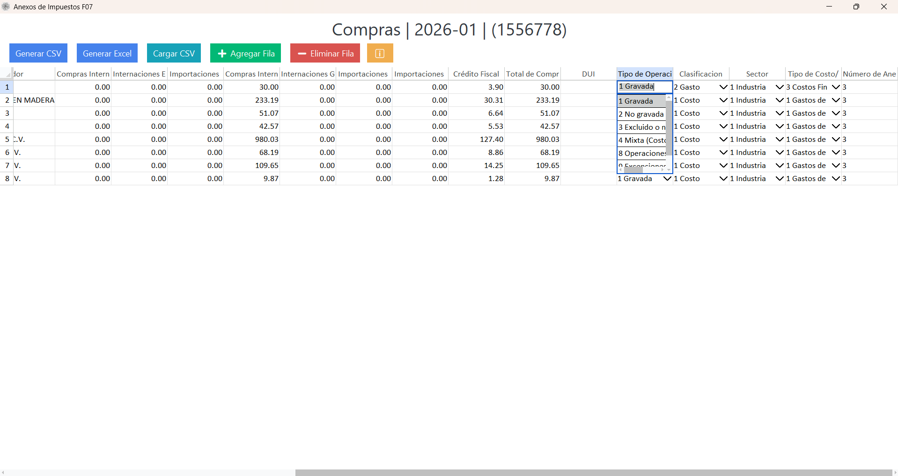
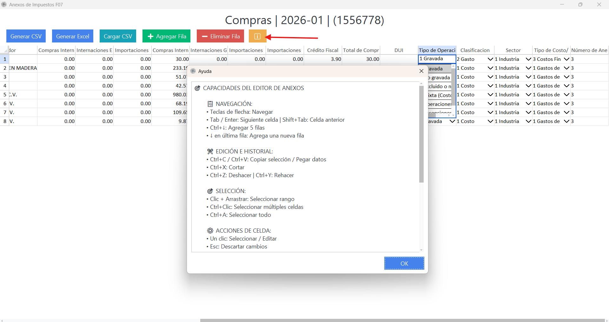
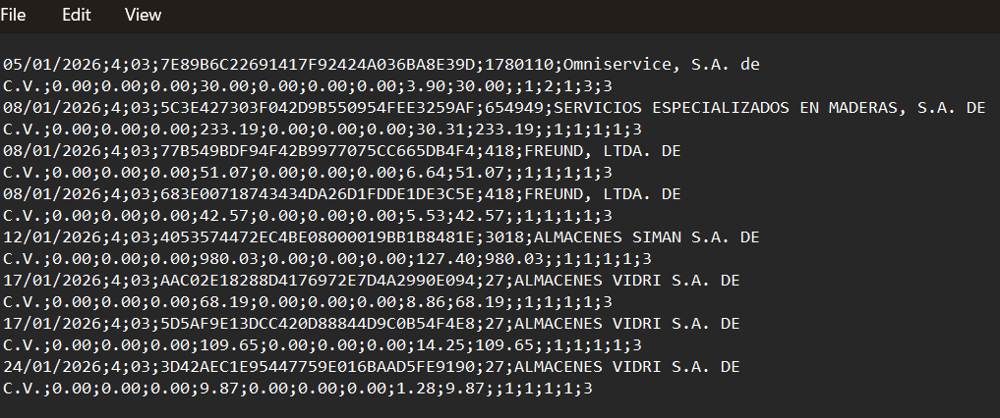
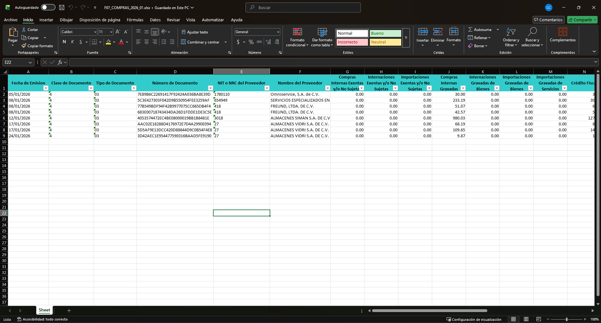

# Anexos de Impuestos F07

## Objetivo
Preparar, revisar y exportar el anexo F07 desde una tabla dinamica con capacidades similares a Excel.

## Alcance del modulo
Este componente permite editar y validar datos antes de generar archivos para uso fiscal y control interno.

{ align=center }

## Funcionalidades principales

### 1) Generar CSV
Genera el anexo de impuestos en formato CSV para ser cargado en el Ministerio de Hacienda.

### 2) Generar Excel
Realiza el volcado de los mismos datos de tabla a Excel para verificaciones adicionales.

### 3) Cargar CSV
Permite complementar o reemplazar el contenido de la tabla con otro CSV cargado por el usuario.

### 4) Agregar fila
Facilita el agregado de filas adicionales cuando se requiere completar informacion no incluida en el origen.

### 5) Eliminar fila
Permite eliminar filas de forma rapida durante el ajuste del anexo.

## Apoyo operativo

### Ayuda del editor
El boton de ayuda resume atajos de navegacion, seleccion y edicion para trabajar mas rapido en la tabla.

{ align=center }

## Salidas generadas

### Archivo CSV generado
Salida del anexo en formato texto delimitado para carga oficial.

{ align=center }

### Archivo Excel generado
Salida en formato de hoja de calculo para revision contable.

{ align=center }

## Verificacion
- Los totales y clasificaciones coinciden con la tabla revisada.
- El CSV abre correctamente y conserva estructura esperada.
- El Excel refleja las mismas filas exportadas desde el editor.

## Relacionados
- [Lector JSON](lector-json.md)
