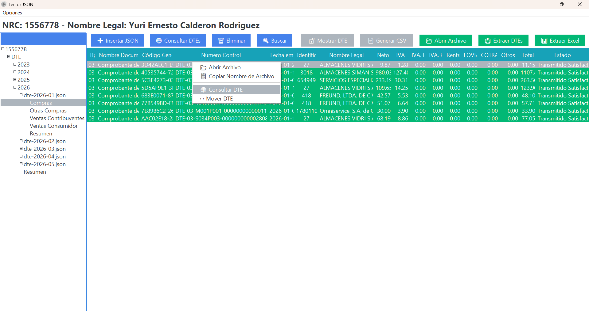
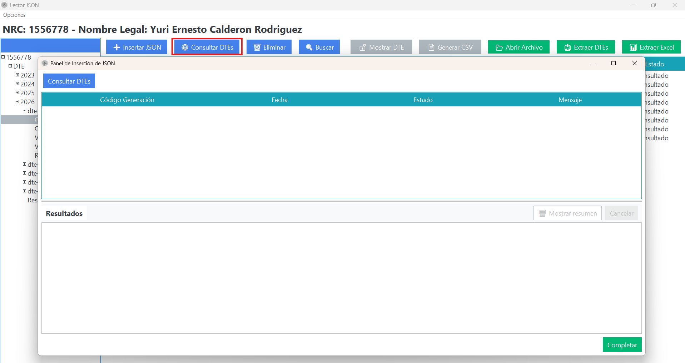
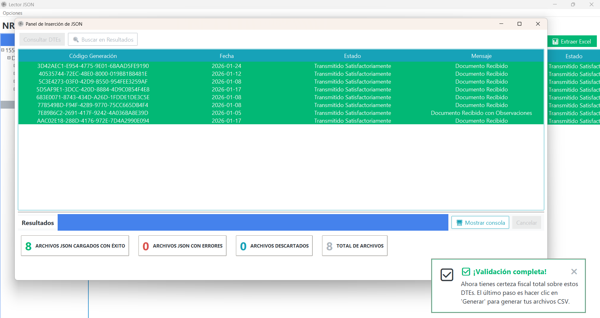
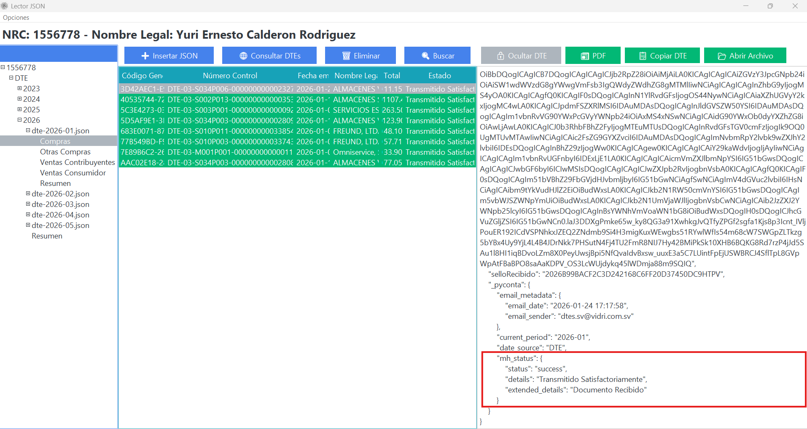

# Consulta en Hacienda

## Objetivo
Verificar el estado oficial de DTE directamente contra la consulta del Ministerio de Hacienda y actualizar metadata interna para trazabilidad y proteccion de reprocesamiento.

## Alcance de la consulta
La consulta de DTE permite obtener:

- Observaciones
- DTE ajustados
- DTE invalidados
- Recuperacion de sello de recepcion

## Modalidades en PyConta

### 1) Consulta individual
Puede ejecutarse sobre un DTE puntual desde las acciones del listado.

{ align=center }

### 2) Consulta masiva por categoria
Tambien puede ejecutarse de forma masiva por categoria para consultar varios DTE en una sola corrida.

{ align=center }

{ align=center }

## Persistencia de datos recuperados
Los datos de la consulta se guardan en metadata interna de PyConta dentro del DTE procesado:

- `_pyconta["mh_status"]`

Este bloque conserva estado, detalles y mensajes devueltos por Hacienda.

{ align=center }

## Estado protegido despues de consulta
Una vez consultados, los DTE quedan con estado protegido. Si se reinsertan posteriormente, no son sobreescritos, optimizando el procesamiento y evitando perdida de trazabilidad.

## Verificacion
- Estado sincronizado con fuente oficial de Hacienda.
- Metadata `_pyconta["mh_status"]` presente en el JSON procesado.
- DTE ya consultados no se sobreescriben al reinsertar.

## Relacionados
- [DTE Sin Sello](../problemas-comunes/dte-sin-sello.md)
