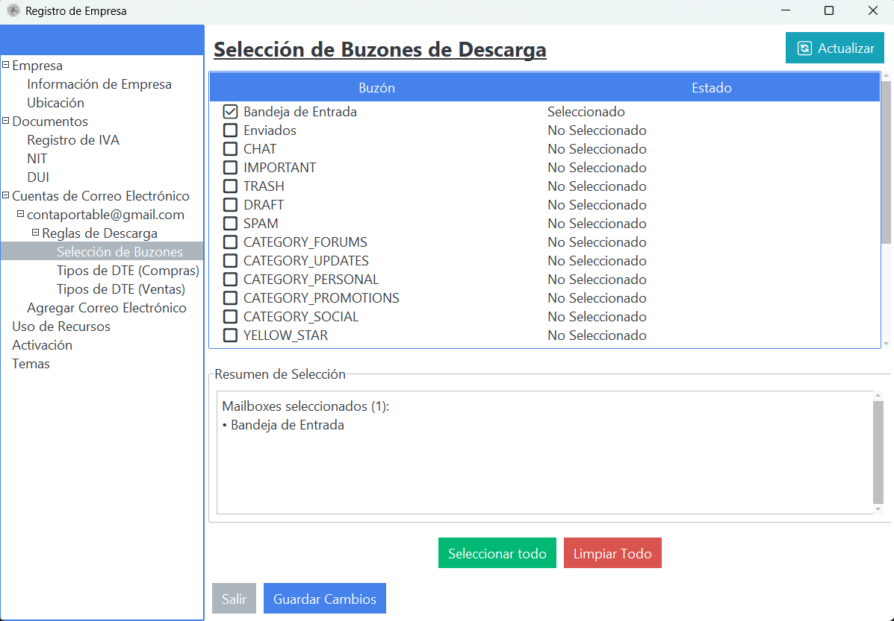
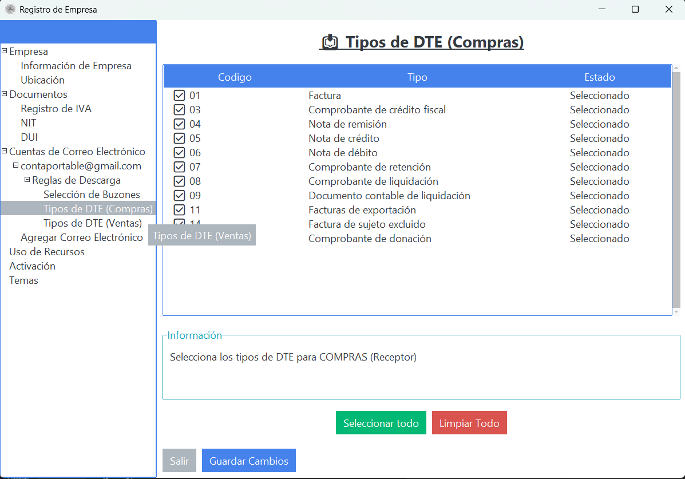
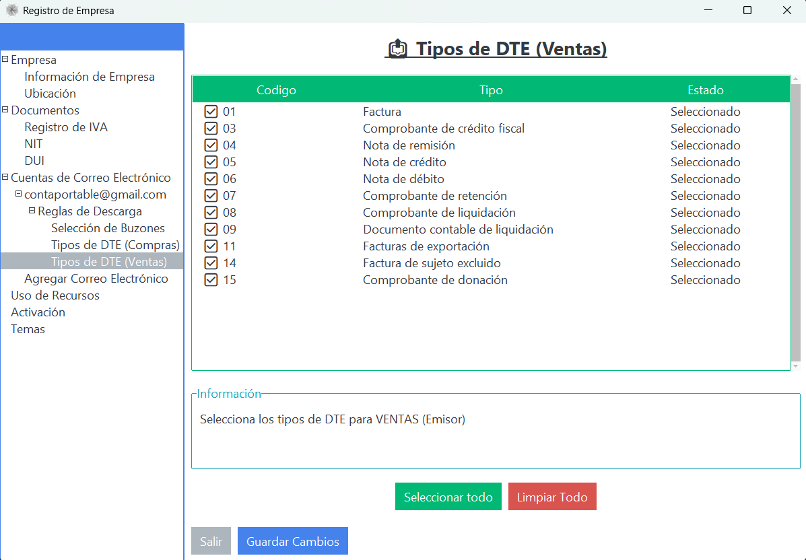
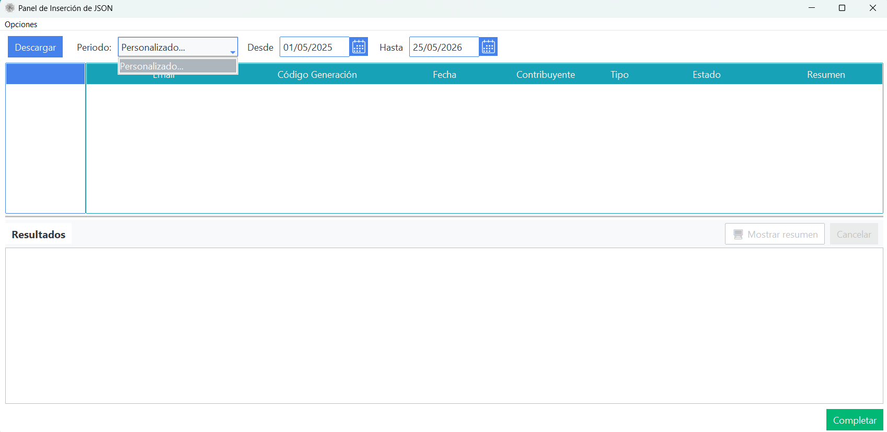
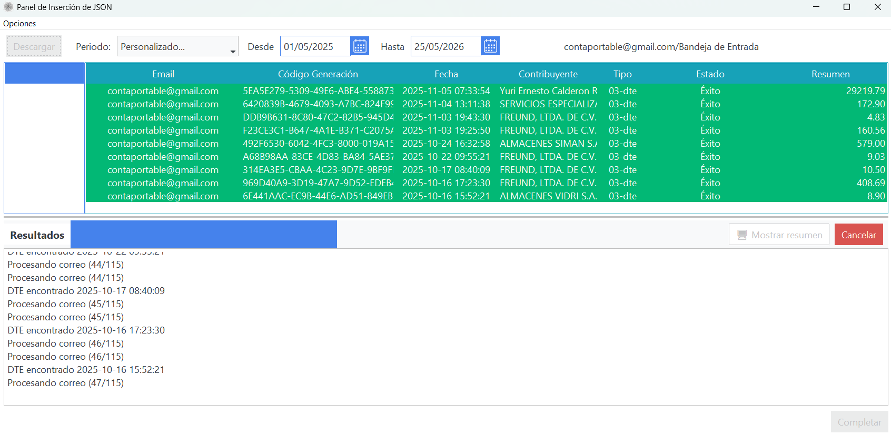
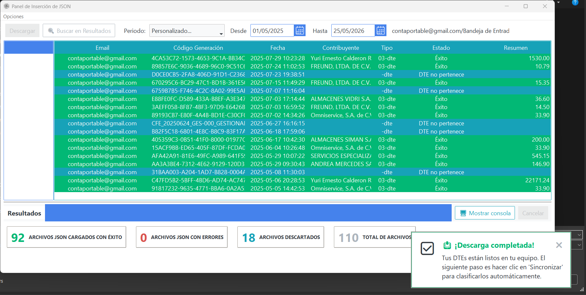

# Descarga Desde Correo

## Objetivo
Descargar automaticamente DTE desde Gmail, Outlook u otros proveedores compatibles.

## Flujo completo para descargar DTE

### 1) Seleccionar cuentas y buzones autorizados
Primero, ingresar a reglas de descarga y confirmar los buzones habilitados por cuenta.

{ align=center }

!!! info "Nota"
    El plan demo permite por defecto unicamente la descarga de la **Bandeja de Entrada** y la **Bandeja de Salida**.

### 1.1) Seleccion de Tipos de DTE (Compras y Ventas)
Configurar que tipos de DTE se descargaran para cada flujo:

- **Compras (Receptor)**
- **Ventas (Emisor)**

{ align=center }

{ align=center }

### 2) Panel de descarga
En el panel de insercion de JSON puedes elegir el rango de descarga:

1. Ultimo Mes Descargado
2. Mes Anterior
3. Ultimos 3 Meses
4. Personalizado...

Por defecto, la **descarga inicial** debe realizarse en modo **Personalizado**, donde se propone inicialmente un rango de un ano. Ese rango puede ajustarse libremente segun la necesidad del usuario.

{ align=center }

### 2.1) Descarga inicial
Ejecutar la primera descarga para construir el historial base de procesamiento.

### 2.2) Descarga en proceso
Durante el proceso se visualiza el detalle de DTE en descarga y los estados encontrados por cada registro.

{ align=center }

### 2.3) Descarga finalizada
Al finalizar, se puede verificar:

- Historial de logs escritos
- Pantalla de resumen (tambien util como filtro)
- Filtros rapidos con la combinacion **Command/Ctrl + F** (varia segun plataforma)

{ align=center }

Luego de esta primera descarga, el sistema lleva el control del historial, por lo que en la siguiente ejecucion sugerira la descarga inteligente del ultimo mes.

## Resultado esperado
- Archivos descargados en carpeta de trabajo.

## Relacionados
- [Sincronizacion](sincronizacion.md)
- [No Descarga Correos](../problemas-comunes/no-descarga-correos.md)
