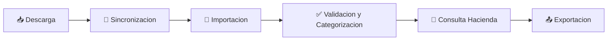

# Flujo Completo DTE

## Objetivo
Ejecutar el ciclo completo desde descarga hasta exportacion y control final.

## Flujo resumido
1. 📥 Descargar y sincronizar correos.
2. 📂 Importar JSON faltantes.
3. ✅ Validar y categorizar DTE.
4. 🔎 Consultar estado en Hacienda.
5. 📤 Exportar a CSV o Excel.

## Criterio de exito
- DTE organizados por contribuyente, periodo y tipo.
- Exportacion sin inconsistencias.
