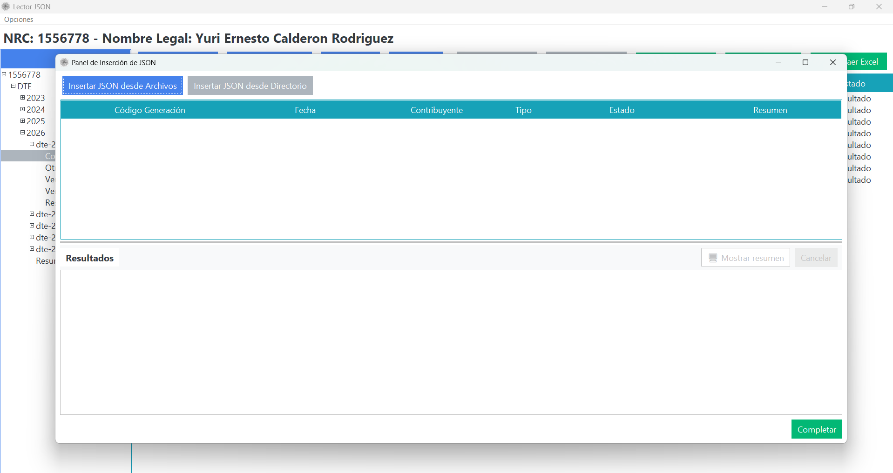
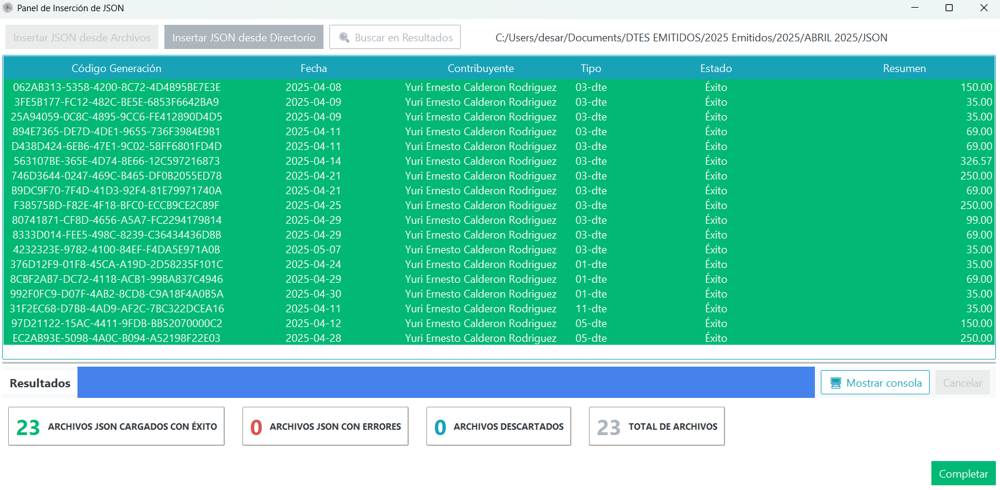

# Importacion JSON

## Objetivo
Insertar DTE localmente desde archivos del equipo cuando no se requiere sincronizacion por correo.

## Flujo de insercion local
Este proceso funciona de forma similar a sincronizacion, pero de forma libre con archivos del equipo.

PyConta ofrece dos opciones para ejecutar este flujo:

- **Insertar JSON desde Archivos**: seleccion manual de uno o mas archivos.
- **Insertar JSON desde Directorio**: seleccion de carpeta con busqueda recursiva en subniveles.

### 1) Panel de insercion local
Vista inicial del panel para iniciar la carga local de JSON desde archivos o desde directorio.

{ align=center }

### 2) Insercion local completada
Resultado final del proceso con el resumen de cargados con exito, errores, descartados y total procesado.

{ align=center }

## Recomendacion operativa
- Usar **Insertar JSON desde Directorio** para cargas masivas o historicas.
- Usar **Insertar JSON desde Archivos** para casos puntuales de correccion o reingreso.
- Verificar al cierre: cargados con exito, con errores, descartados y total de archivos.

## Verificacion
- Documentos visibles en listado con estado **Exito** cuando corresponde.
- Totales de resultados coherentes con los archivos insertados.
