# Lector JSON

## Objetivo
Gestionar, consultar y extraer DTE ya cargados en el sistema desde un panel centralizado.

## Funcionalidades del modulo

### 1) Separacion por estructura (anio, mes y categorias)
El arbol lateral permite navegar por anio, mes y categorias:

- Compras
- Otras Compras
- Ventas Contribuyentes
- Ventas Consumidor

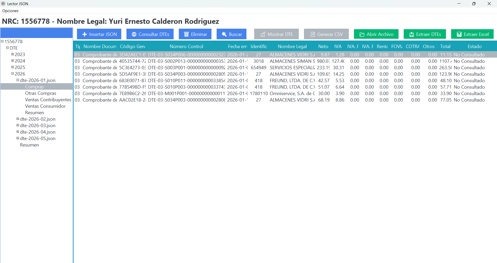{ align=center }

### 2) Resumenes graficos personalizables
El apartado de resumen muestra analisis visual mensual y anual. Puede configurarse para incluir o descartar DTE segun reglas de analisis.

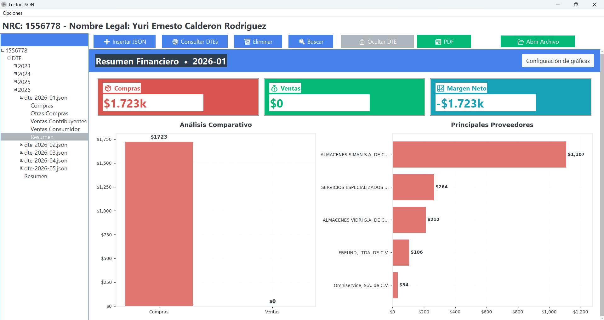{ align=center }

### 3) Menú Contextual para consultar DTE y acciones disponibles
Desde el menu contextual donde se listan las opciones de consulta y acciones para cada DTE:

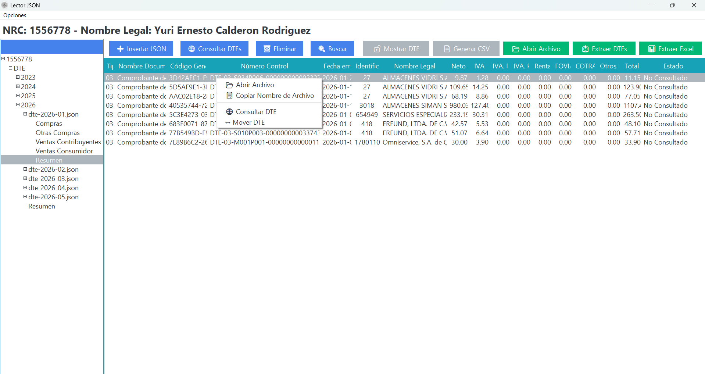{ align=center }

### 4) Eliminar DTE
La opcion **Eliminar** permite retirar registros seleccionados cuando se requiera depuracion.

### 5) Buscar DTE
La barra de busqueda permite filtrar por datos clave para ubicar rapidamente documentos.

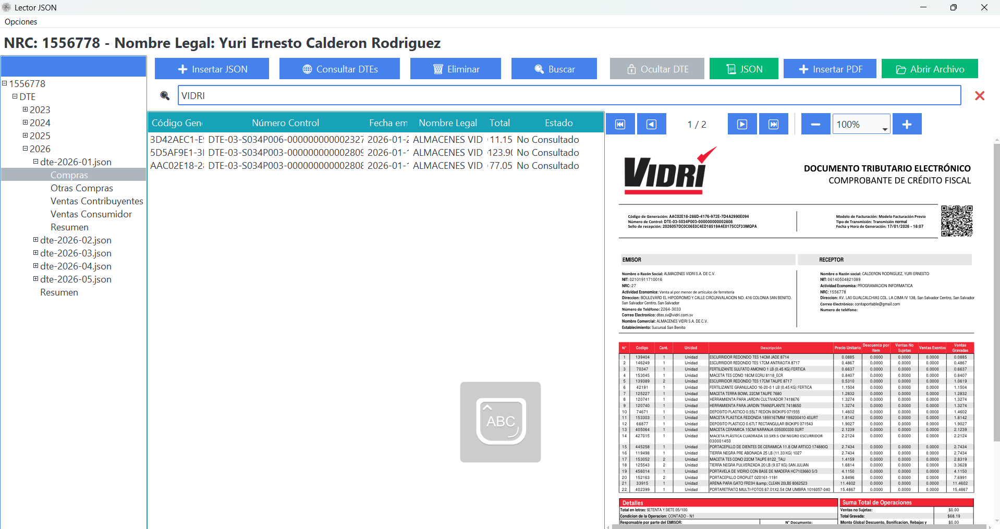{ align=center }

### 6) Mostrar DTE (alternado JSON y PDF)
El visor permite alternar entre modo JSON y modo PDF para revisar contenido tecnico y representacion visual del documento.

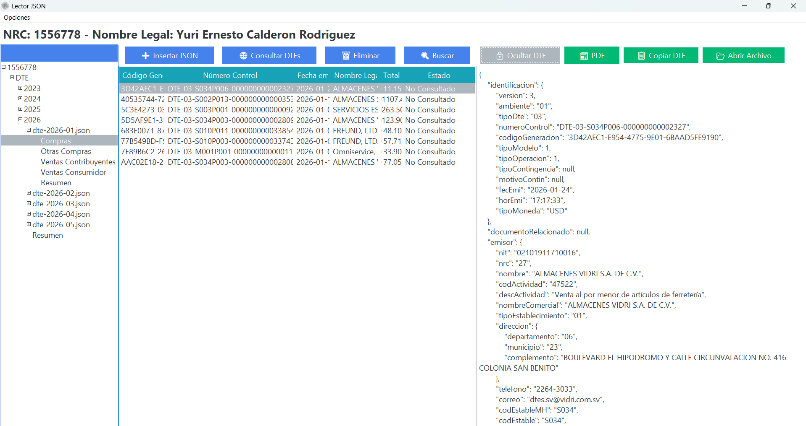{ align=center }

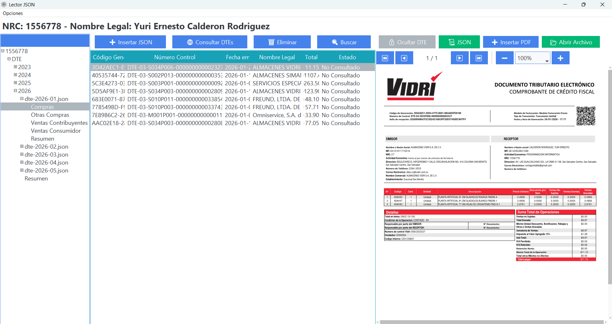{ align=center }

### 7) Generar CSV
Permite exportar informacion tabular para trabajo contable y revision externa.

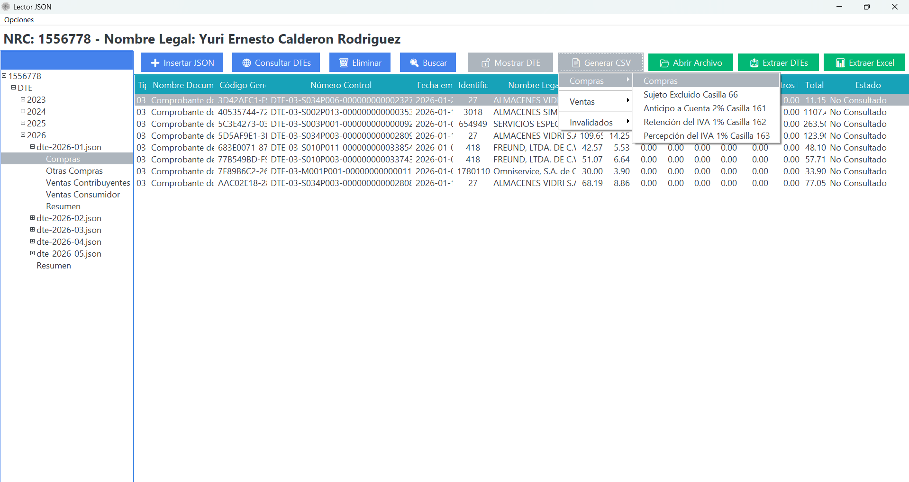{ align=center }

### 8) Abrir Archivo
La opcion **Abrir Archivo** abre el documento fuente en el sistema operativo.

### 9) Extraer DTEs
Permite extraer DTE por periodos disponibles en el arbol (mes o anio).

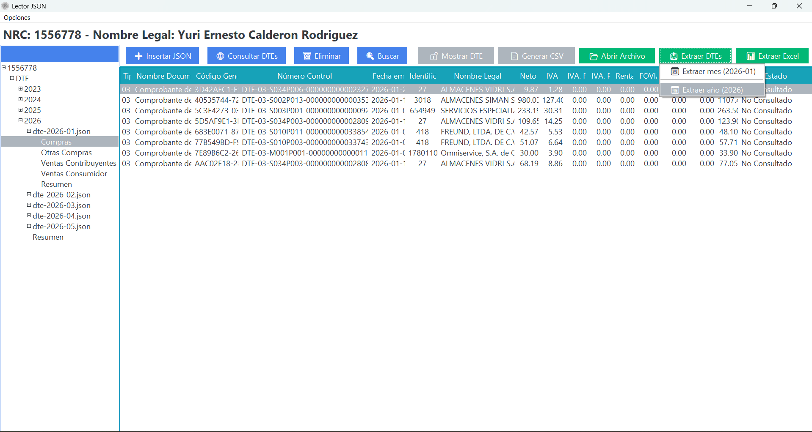{ align=center }

### 10) Extraer Excel
Permite generar salida Excel por periodo para analisis financiero.

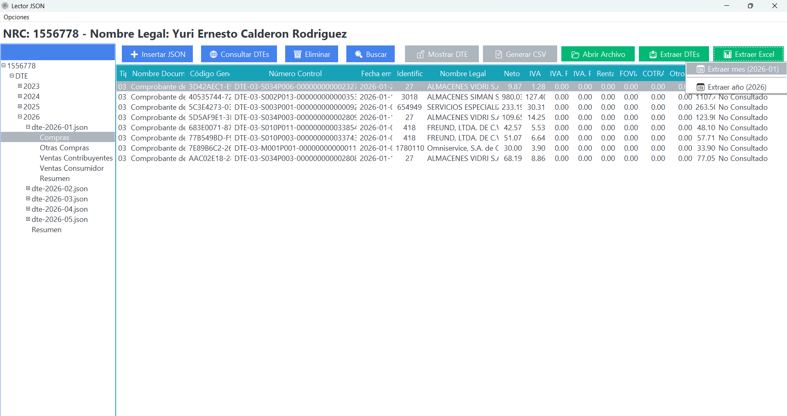{ align=center }

### 11) Extraer seleccionados
Desde la seleccion de filas, se puede extraer un subconjunto especifico de DTE/Excel.

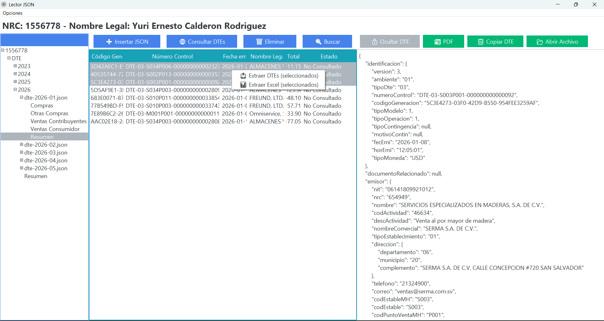{ align=center }

### 12) Mover DTE
Permite mover un DTE a otro periodo (anio/mes) cuando se requiere reclasificacion.

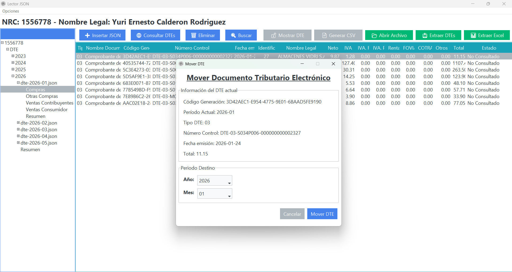{ align=center }

## Extra util
### Exportar metadatos
Adicionalmente, el sistema permite exportar metadatos por anio y mes.

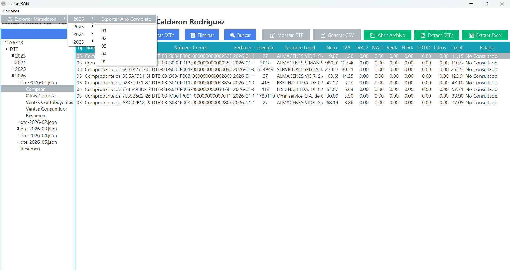{ align=center }

## Verificacion
- El arbol de periodos y categorias refleja la estructura esperada.
- Las consultas, busqueda y visualizacion JSON/PDF responden correctamente.
- Las salidas CSV/Excel y extracciones se generan en el destino esperado.
