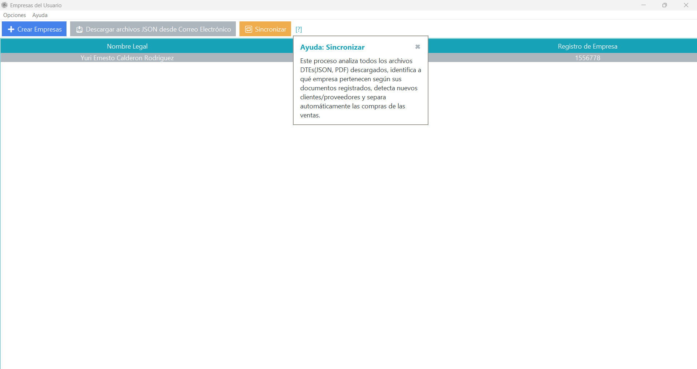
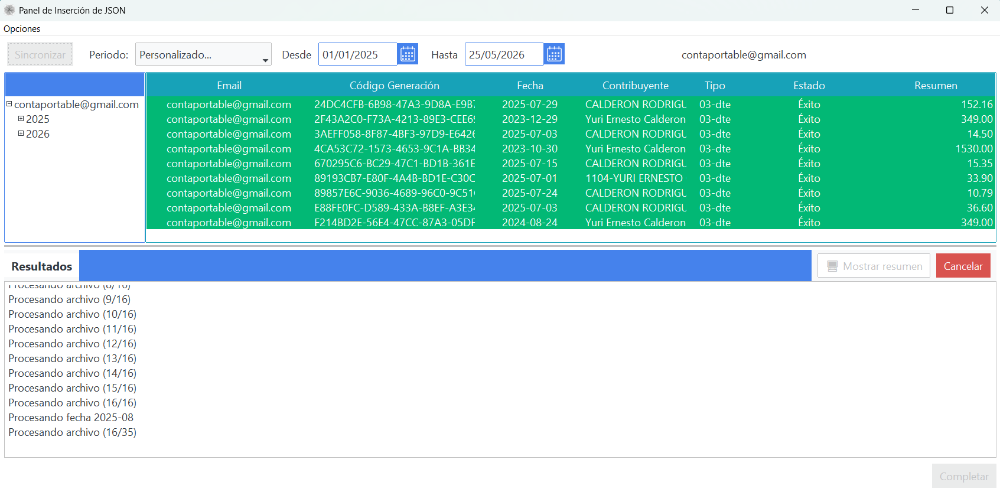
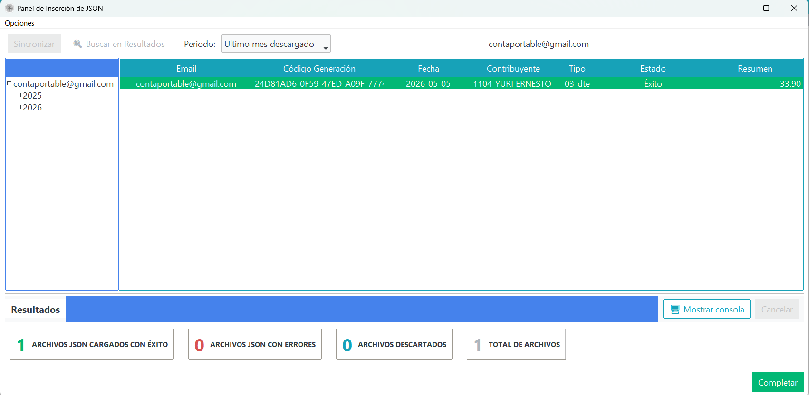

# Sincronizacion

## Objetivo
Ejecutar la lectura de la carpeta de descargas creada en el paso anterior, separar documentos segun tipo de contribuyente y aplicar una segunda validacion rapida.

## Flujo de sincronizacion

### 1) Tooltip de sincronizacion
Desde la pantalla de descarga, usar el acceso de sincronizacion para iniciar la lectura de archivos descargados.

{ align=center }

### 2) Sincronizacion en proceso
Durante el proceso, el sistema:

- Lee la carpeta de descargas configurada.
- Separa documentos por tipo de contribuyente.
- Ejecuta una segunda validacion mas rapida para clasificacion.
- Muestra el detalle de avance y estados en tiempo real.

{ align=center }

### 3) Sincronizacion completada
Al finalizar, se muestran los resultados consolidados del proceso.

- Totales de archivos cargados con exito.
- Archivos con error y descartados.
- Total general procesado.

{ align=center }

Luego de la primera descarga y sincronizacion, el sistema conserva historial operativo y facilita ejecuciones siguientes con menor friccion.

## Verificacion
- Se actualizan los contadores de resultados.
- La clasificacion por tipo de contribuyente queda aplicada.
- No se reportan errores bloqueantes en el cierre del proceso.
