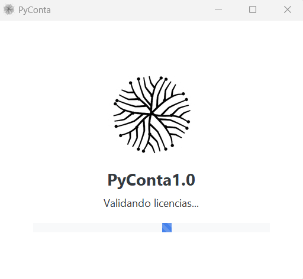
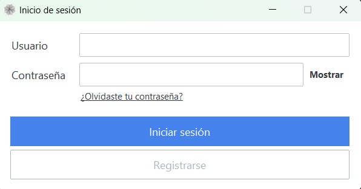

# Instalacion y Acceso

## Objetivo
Dejar PyConta listo para iniciar sesion, instalarlo a nivel de usuario y comenzar procesamiento de DTE.

## Antes de empezar
- Instalacion a nivel de usuario: PyConta se instala y ejecuta sin requerir permisos de administrador.
- Internet: conexion estable para sincronizacion, correo y activacion.
- Información exacta de empresa según tarjeta de IVA para registro.
- Emails a conectar con PyConta.

## Pasos
1. Confirmar que la instalacion fue realizada para el usuario actual.
2. Abrir PyConta y validar pantalla de inicio.
3. Crear tu primer usuario local.

### Pantalla de carga
{ align=center }

### Pantalla de login
{ align=center }

## Siguientes pasos
1. Ir a [Registro de Usuario](registro-usuario.md).
2. Continuar con [Configuracion Inicial](configuracion-inicial.md).
3. Si ya conoces el plan, revisar [Licencias y Planes](licencias-y-planes.md).
4. Revisar [Información Importante](../informacion-importante/certificacion-seguridad-casa-nivel-2.md) para ver el cumplimiento CASA y otros requisitos.

## Errores frecuentes
- Instalacion hecha fuera del perfil de usuario: reinstalar para el usuario correcto.
- Credenciales invalidas.
- Conexion de red inestable.

## Relacionados
- [Registro de Usuario](registro-usuario.md)
- [Configuracion Inicial](configuracion-inicial.md)
- [Licencias y Planes](licencias-y-planes.md)
- [Soporte con PIN](../suscripcion-y-soporte/solicitar-soporte-con-pin.md)
