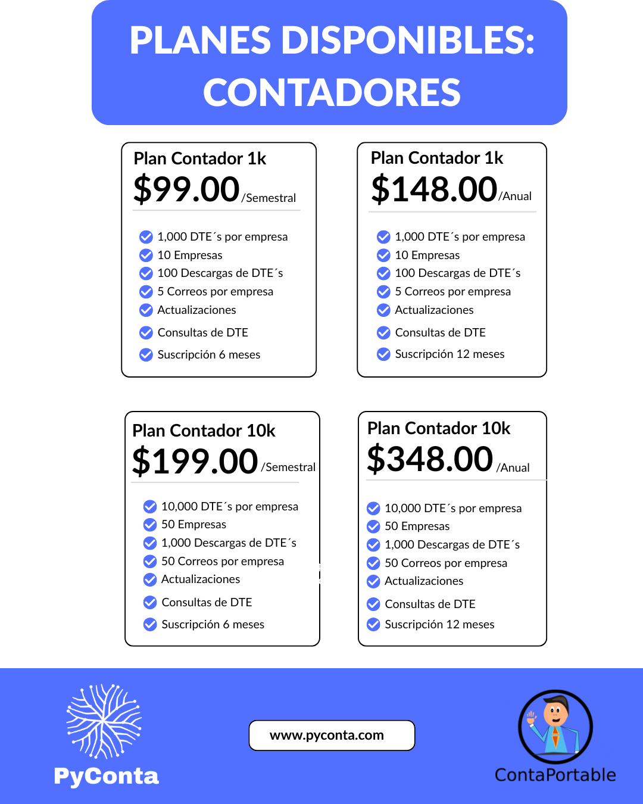
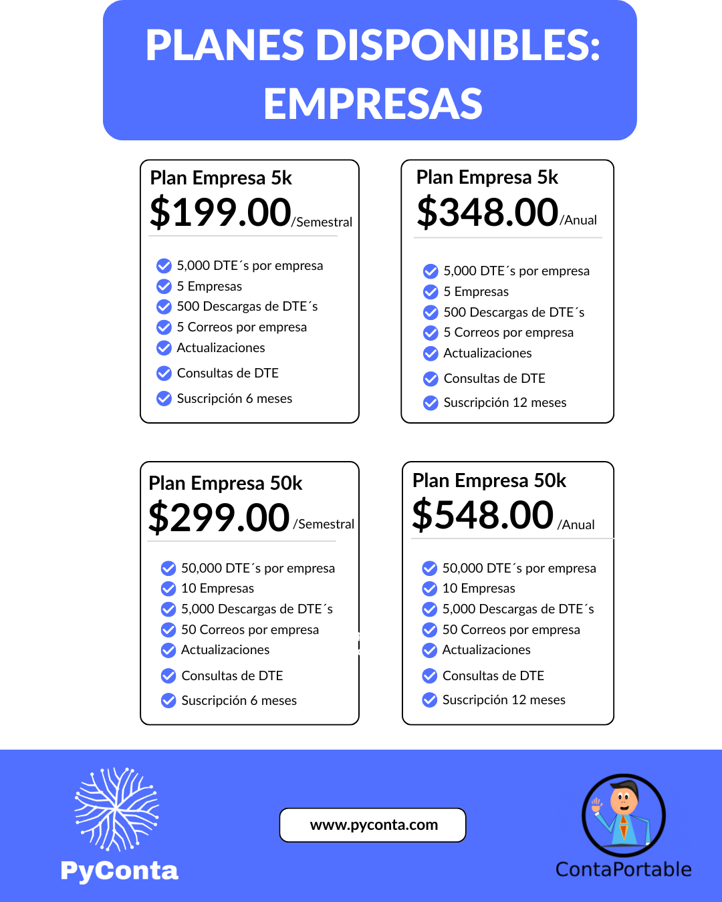
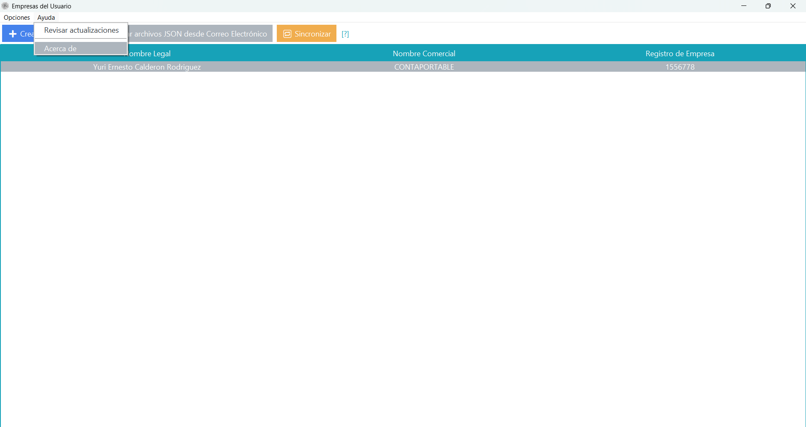
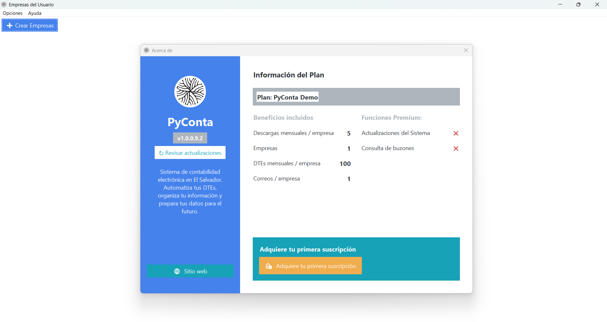
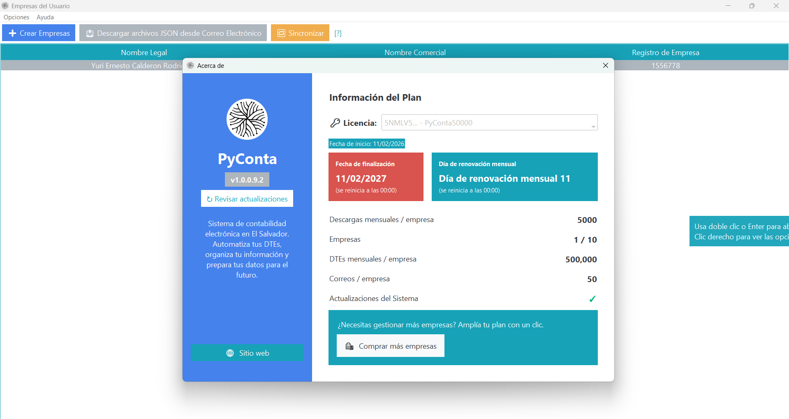

# Licencias y Planes

## Objetivo
Explicar el plan demo de PyConta, los planes premium disponibles y cómo interpretar la vista "Acerca de" según el tipo de licencia activa.

## Plan demo
PyConta incluye un plan demo para conocer la plataforma antes de adquirir una suscripción.

### Demo
- Prueba gratuita para conocer PyConta.
- Costo: gratis.
- Descargas mensuales: 5.
- Empresas: 1.
- DTEs: 100.
- Correos: 1.
- Actualizaciones: no incluidas.
- Consulta DTE: no incluida.

## Planes premium
Los planes premium amplían los límites permitidos y pueden variar según lo que más convenga a empresas y contadores.

### Planes para contadores
{ align=center }

### Planes para empresas
{ align=center }

## Cómo ver a detalle tu plan activo en PyConta
Desde la pantalla principal, ir al menú **Ayuda** y luego seleccionar **Acerca de**.

{ align=center }

## Plan Demo en "Acerca de"

{ align=center }

## Plan Premium en "Acerca de"

{ align=center }

## Activación y verificación
1. Gestionar la activación o renovación con nuestra área de ventas.
2. Activar la licencia en tus empresas registradas.
3. Verificar en "Acerca de" que el plan, fechas y límites coincidan con lo contratado.

## Soporte y renovación
- Para soporte con PIN ver: [Solicitar Soporte con PIN](../suscripcion-y-soporte/solicitar-soporte-con-pin.md)
- Para renovación, finalización o upgrade ver: [Renovación, Finalización y Upgrade](../suscripcion-y-soporte/renovacion-finalizacion-upgrade.md)
