# Registro de Empresa (Detalles)

## Objetivo
Documentar el flujo completo de registro de empresa y la activación del plan para dejar la empresa lista para operar.

## Flujo de registro

### Paso previo: Crear empresa
Desde la pantalla de empresas del usuario, seleccionar **Crear Empresas** para iniciar el asistente.

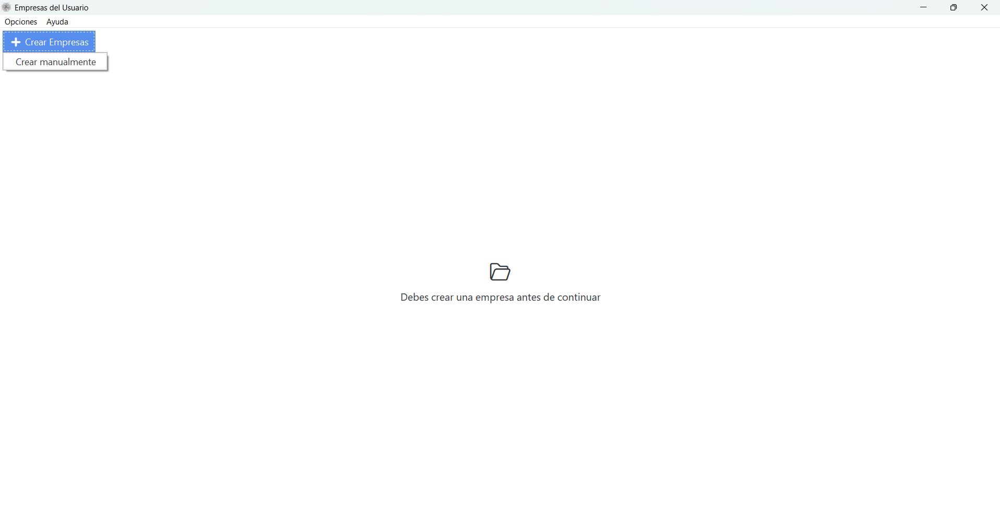{ align=center }

### 1) Información de la empresa
Completar los datos exactamente como aparecen en la tarjeta de IVA.

!!! warning "Importante"
	El campo **Nombre Legal** debe escribirse completo y exacto.
	Este campo es único y afecta las activaciones del plan contratado.

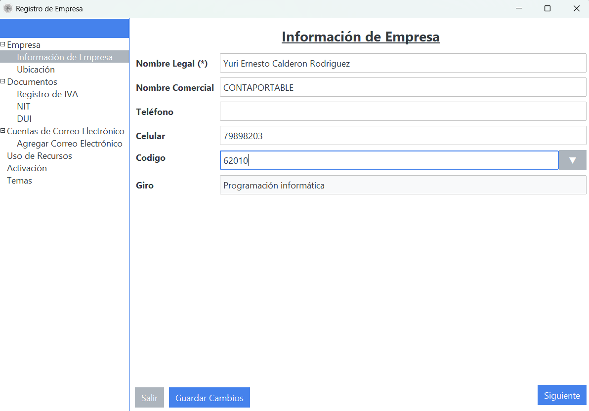{ align=center }

### 2) Ubicación
Registrar país, departamento, municipio, distrito y dirección según tarjeta de IVA.

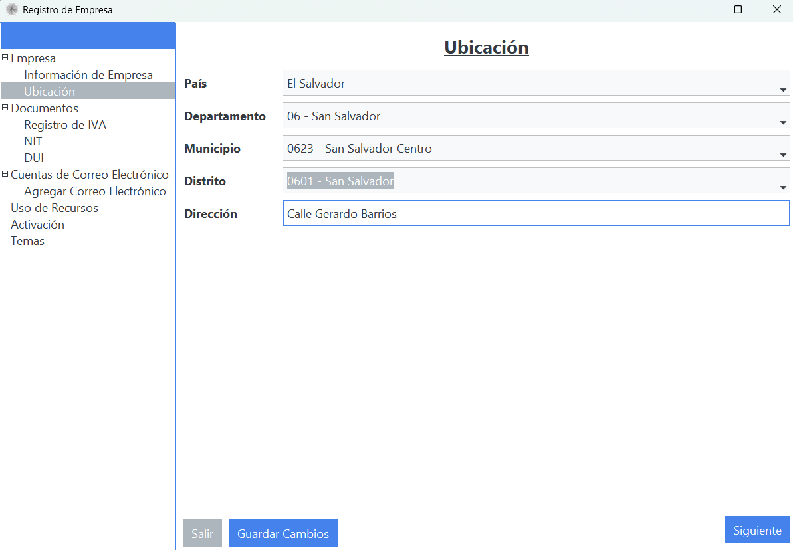{ align=center }

### 3) Registro de IVA
Campo obligatorio. Debe ingresarse correctamente desde el inicio.

!!! warning "Importante"
	El Registro de IVA no se puede volver a cambiar.

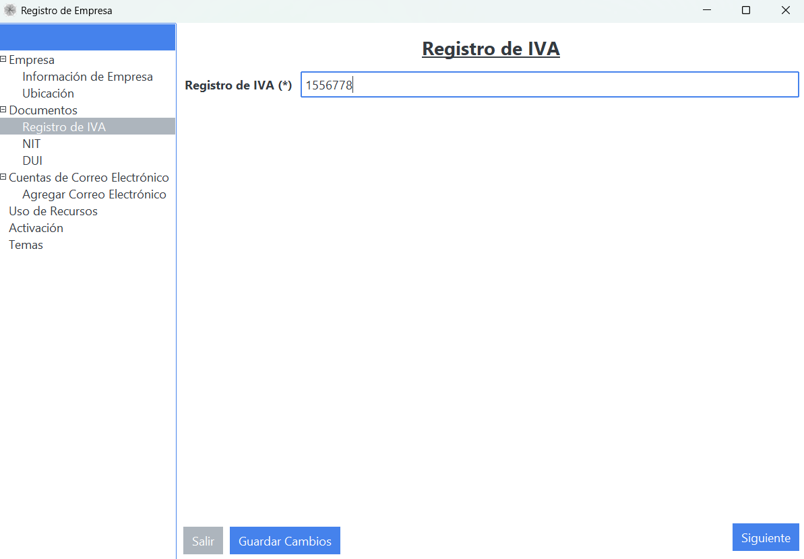{ align=center }

### 4) NIT
Campo obligatorio. Debe coincidir con el documento fiscal de la empresa.

!!! warning "Importante"
	El NIT no se puede volver a cambiar.

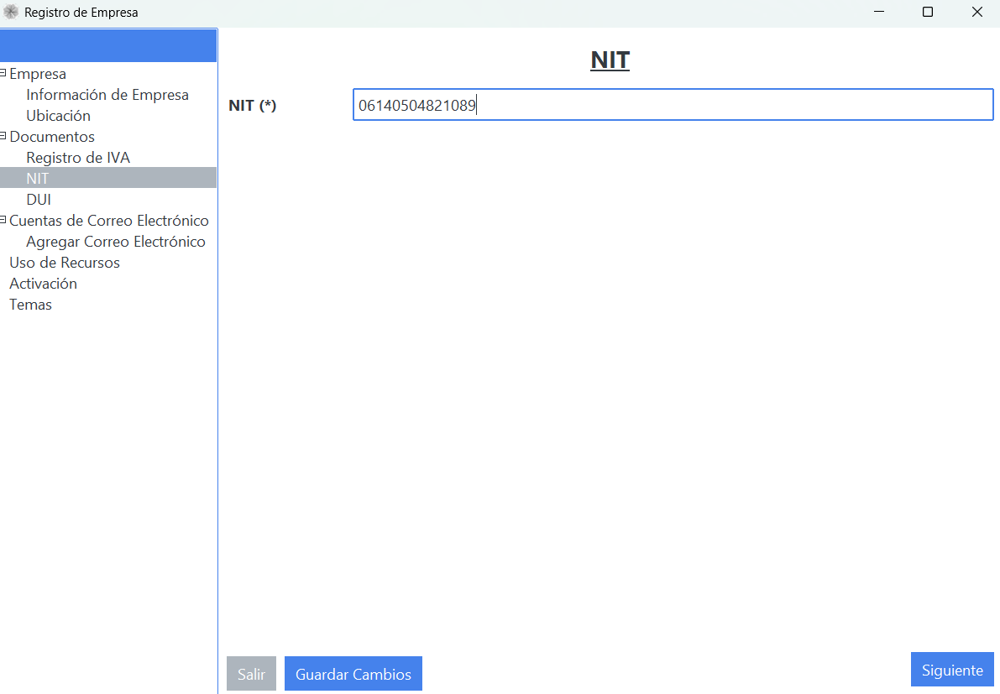{ align=center }

### 5) DUI
Campo opcional.

- Aplicable cuando una empresa desea llevar registro de compras como consumidor final.
- También aplica para no contribuyentes que desean llevar control financiero.

### 6) Cuentas de correo electrónico
Puedes agregar cuentas según el límite de tu plan.

- Completar proveedor de correo, correo, método de autenticación y estado.
- Revisar carpeta de descarga (bandeja de entrada / enviados) y rol de lectura (emisor o receptor).
- Confirmar que todos los campos requeridos estén completos para lograr una conexión exitosa.

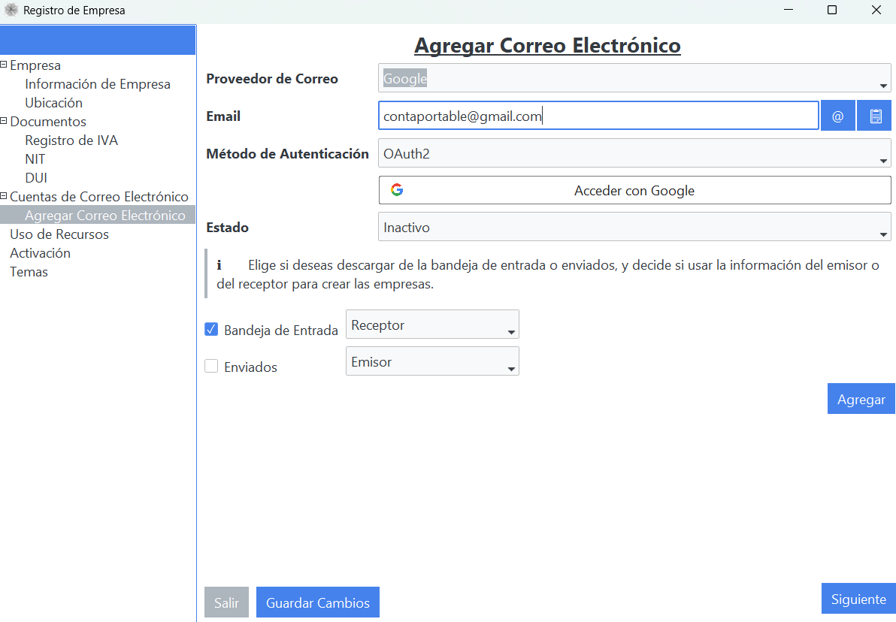{ align=center }

#### OAuth de Google (si aplica)
Al autenticar con Google, revisar permisos antes de continuar.

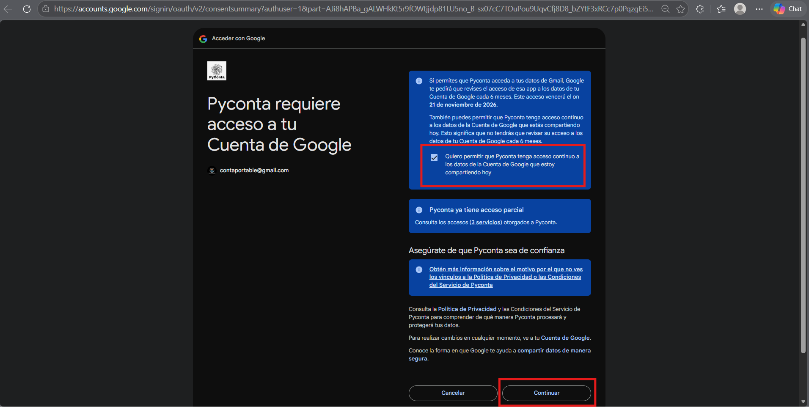{ align=center }

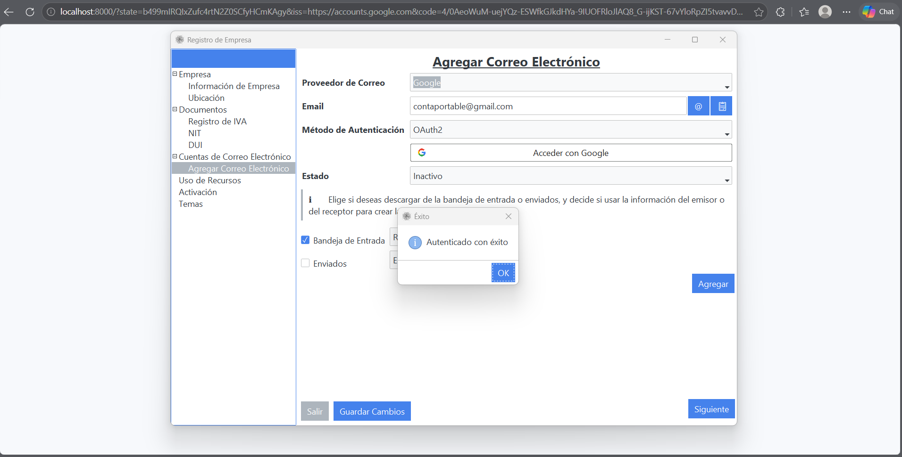{ align=center }

### 7) Activación

#### 7.1 Activar para aplicar upgrade de plan
Ingresar la clave y activar para aplicar el upgrade del plan adquirido.

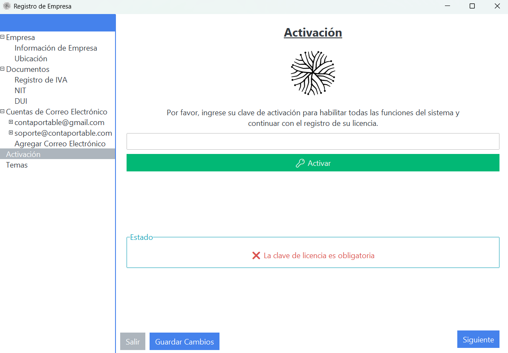{ align=center }

#### 7.2 Activación exitosa
Verificar el estado de activación, plan actual y fechas de vigencia.

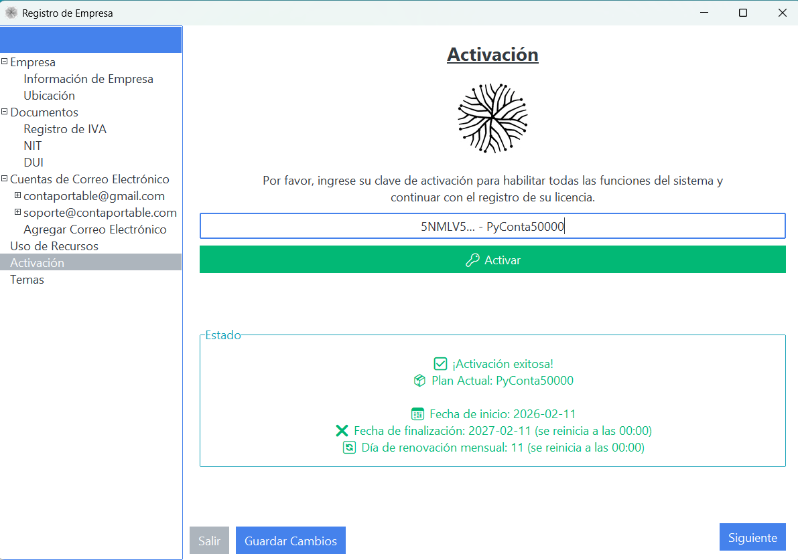{ align=center }

### 8) Temas
Puedes escoger entre una variedad de temas para estilizar la experiencia de tus empresas.

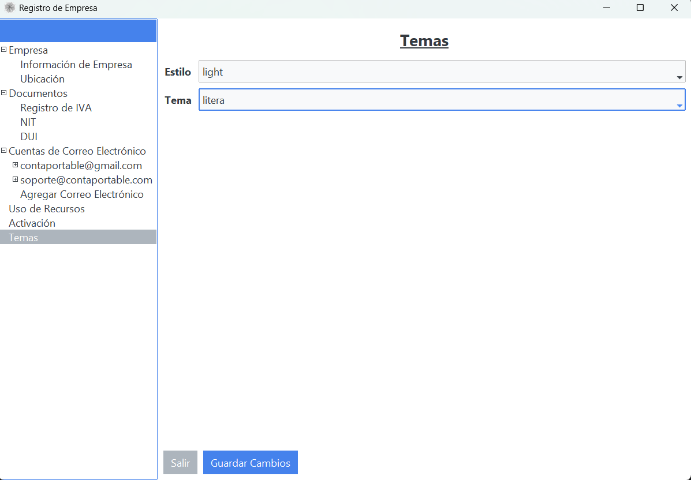{ align=center }

## Verificación
- Se completa el registro con datos fiscales correctos.
- Se agregan correos y autenticación según plan.
- La activación muestra el plan esperado y vigencia correcta.

## Relacionados
- [Crear Primera Empresa](crear-primera-empresa.md)
- [Descarga Desde Correo](../flujos/descarga-desde-correo.md)
