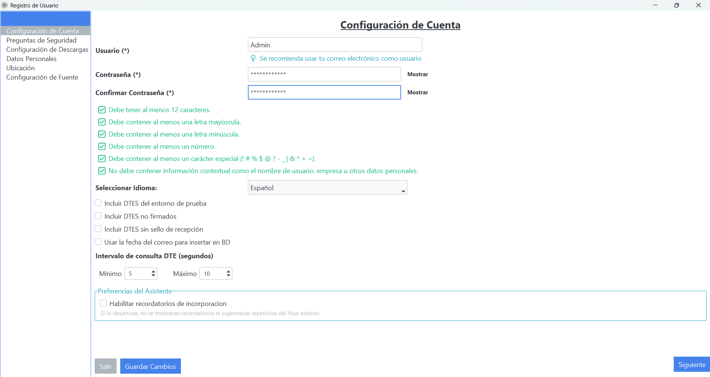
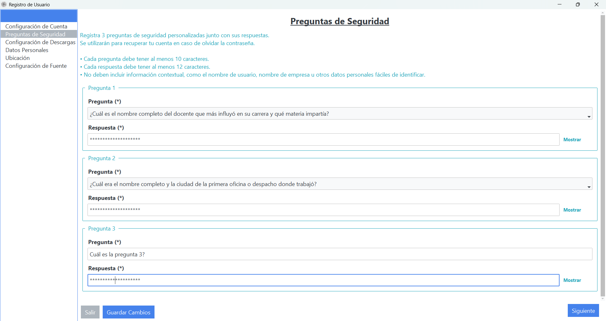
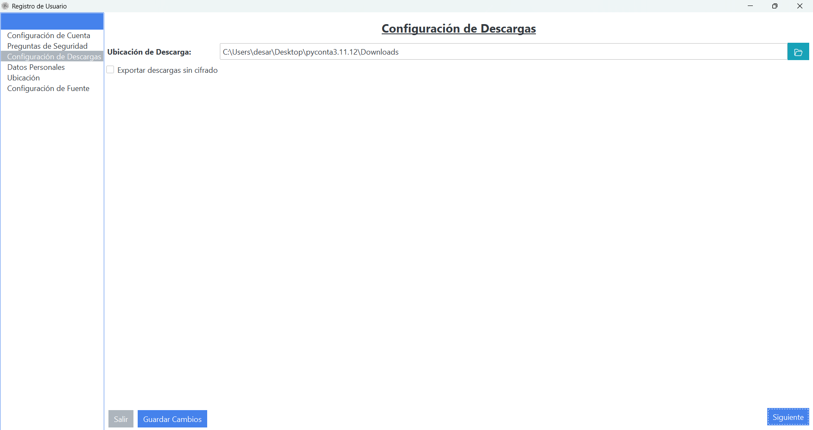
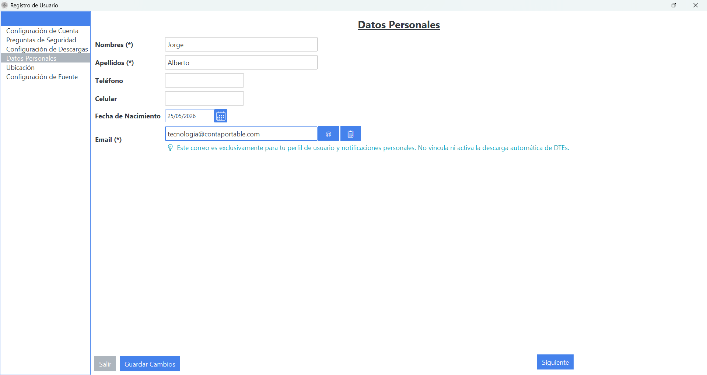
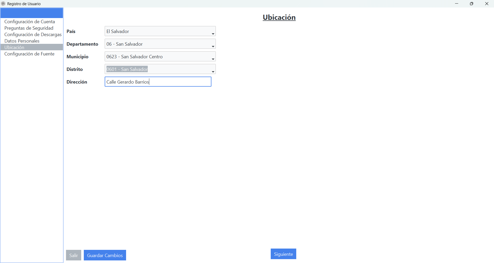
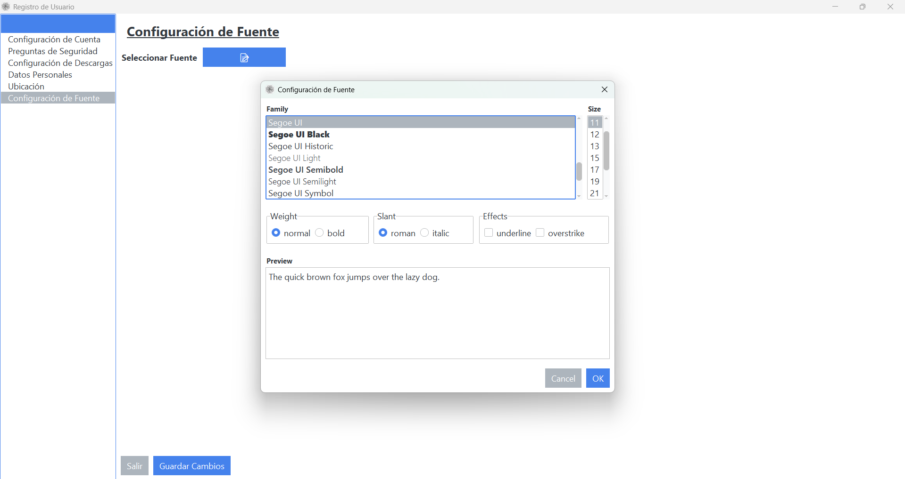
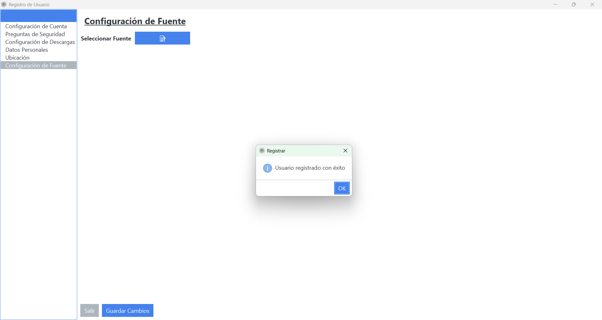

# Registro de Usuario

## Objetivo
Crear y activar la cuenta de usuario que permitirá iniciar sesión en PyConta.

## Antes de empezar
- Tener conexión a internet.
- Disponer de una dirección de correo válida para el registro.
- Preparar las capturas del flujo completo de registro para documentar cada paso.

## Flujo de registro de usuario

### 1) Configuración de cuenta
En esta sección se configura la base del usuario y parámetros de operación.

Índice rápido de este paso:
- Parámetros de validaciones de contraseña y reglas activas.
- Regla **"Usar la fecha del correo para insertar en BD"** (activar solo cuando aplique al flujo del cliente).
- Intervalo de consulta de DTE (segundos): definir un rango operativo estable.
- Preferencias del asistente: habilitar o deshabilitar recordatorios de incorporación.

{ align=center }

### 2) Preguntas de seguridad
Estas preguntas deben ser seguras y fáciles de recordar para el titular de la cuenta.

!!! warning "Importante"
	Este será el único método de verificación para recuperación de acceso.
	Las respuestas deben resguardarse en un medio interno seguro y con acceso restringido.

{ align=center }

### 3) Configuración de descargas
Aquí se define la ruta donde se descargarán los DTE.

- Por defecto, la ruta corresponde a la ubicación de instalación.
- Si el cliente lo requiere, se puede cambiar a otra ruta autorizada.
- Si el usuario necesita los DTE sueltos en esa carpeta, debe activar **"Exportar descargas sin cifrado"**.

{ align=center }

### 4) Datos personales
Completar los campos obligatorios con información real y vigente.

- Validar nombres y apellidos.
- Registrar un correo real de uso del usuario.
- Verificar formato de fecha y datos de contacto.

{ align=center }

### 5) Llenar ubicación
Completar la ubicación y dirección según los datos reales de la empresa o del usuario.

- País, departamento, municipio y distrito.
- Dirección exacta para mantener consistencia documental.

{ align=center }

### 6) Extra: configuración de fuente
Opcionalmente, se puede ajustar la fuente para mejorar legibilidad según preferencia del usuario.

{ align=center }

### Confirmación de registro
Al finalizar el formulario, guardar cambios y confirmar el mensaje de éxito.

{ align=center }

## Verificación
- Ingresar sin error y visualizar el panel principal.
- Comprobar versión en "Acerca de" (muestra plan y límites).

## Errores frecuentes
- Correo ya registrado: usar recuperación de contraseña o contactar soporte.
- No llega correo de verificación: revisar spam y filtros.

## Diferencias Demo vs Plan pago
- PyConta0: no se solicita clave de activación; límites reducidos aplican automáticamente (ver "Acerca de").
- Plan pago: tras ingresar la clave de activación el usuario obtiene los límites y permisos del plan contratado.

## Relacionados
- [Instalación, Acceso y Requisitos](instalacion-acceso.md)
- [Licencias y Planes](licencias-y-planes.md)
